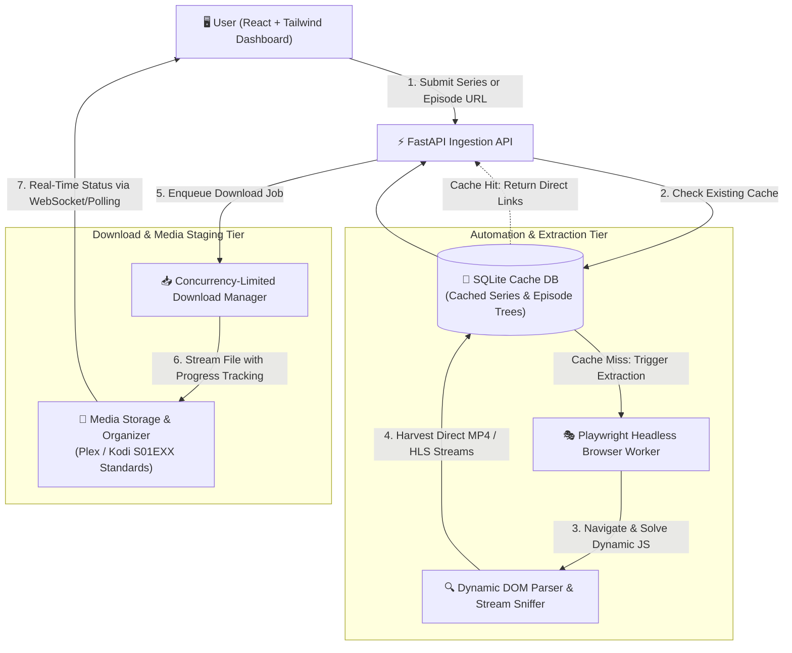

<div align="center">

# ⚡ Arabic Toons Downloader (`cartoon`)

### High-Performance Media Scraping & Batch Downloader Engine

[](https://www.python.org/)
[](https://fastapi.tiangolo.com/)
[](https://playwright.dev/)
[](https://reactjs.org/)
[](https://vitejs.dev/)
[](https://tailwindcss.com/)
[](https://www.sqlite.org/)
[](https://www.docker.com/)
[](https://cartoon-stream.pages.dev/)
[](LICENSE)

**1-Click Season Batch Downloader • Playwright Scraping Layer • Media Server (Plex/Kodi) Formatting**

[🌐 Live Web UI](https://cartoon-stream.pages.dev/) • [Pipeline Architecture](#-pipeline-architecture) • [Core Capabilities](#-core-capabilities) • [Docker Deployment](#-docker-deployment) • [Local Development](#-local-development)

</div>

---

## 🎯 Overview

**Arabic Toons Downloader** is an end-to-end full-stack media automation platform engineered to solve the friction of downloading and archiving classic Arabic cartoon series.

By combining an asynchronous **FastAPI** backend, headless **Playwright** browser automation, and a reactive **React + TailwindCSS** interface, the platform bypasses dynamic streaming obfuscation, captures direct high-definition video sources, and arranges them into organized folders compatible with **Plex** and **Kodi** home theater libraries.

---

## 🏗 Pipeline Architecture

The scraping and downloading workflow is orchestrated through a resilient multi-stage pipeline:


```mermaid
flowchart TD
    User["🖥️ User (React + Tailwind Dashboard)"]
    API["⚡ FastAPI Ingestion API"]
    
    subgraph Automation & Extraction Tier
        Cache[("💾 SQLite Cache DB<br/>(Cached Series & Episode Trees)")]
        PlaywrightWorker["🎭 Playwright Headless Browser Worker"]
        DOMExtractor["🔍 Dynamic DOM Parser & Stream Sniffer"]
    end
    
    subgraph Download & Media Staging Tier
        Queue["📥 Concurrency-Limited Download Manager"]
        FileTree["📁 Media Storage & Organizer<br/>(Plex / Kodi S01EXX Standards)"]
    end

    User -->|1. Submit Series or Episode URL| API
    API -->|2. Check Existing Cache| Cache
    
    Cache -.->|Cache Hit: Return Direct Links| API
    Cache -->|Cache Miss: Trigger Extraction| PlaywrightWorker
    
    PlaywrightWorker -->|3. Navigate & Solve Dynamic JS| DOMExtractor
    DOMExtractor -->|4. Harvest Direct MP4 / HLS Streams| Cache
    Cache --> API
    
    API -->|5. Enqueue Download Job| Queue
    Queue -->|6. Stream File with Progress Tracking| FileTree
    FileTree -->|7. Real-Time Status via WebSocket/Polling| User
```

---

## 🌟 Core Capabilities

- ⚡ **1-Click Full Series Archiving:** Input any series overview URL to automatically discover, index, and download all episodes in sequential order.
- 🎭 **Resilient Playwright Automation:** Emulates real browser sessions to navigate dynamic client-side rendering, bypass intermediate redirect screens, and capture real CDN video streams.
- 🧠 **Dual-Database Smart Caching:** Leverages SQLite caching (`cartoon.db` & `anime_cache.db`) to avoid repeated network requests and speed up queries for already indexed series.
- 📺 **Media Server Compatibility:** Automatically sanitizes titles and writes files using the industry-standard naming schema (`Series Name - S01E{number}.mp4`) for automatic indexing in **Plex**, **Jellyfin**, and **Kodi**.
- 📊 **Interactive Web Dashboard:** Real-time download progress tracking, searchable historical library, and direct directory opening triggers.
- 🐳 **Isolated Docker Compose Setup:** Pre-packaged with Chromium browser binaries and system fonts for predictable cross-platform deployment.

---

## 🐳 Docker Deployment

### Prerequisites
- [Docker Engine](https://docs.docker.com/engine/install/) & [Docker Compose](https://docs.docker.com/compose/) v2+

### Quick Start
Clone the repository and launch the containerized stack:

```bash
# Clone the repository
git clone https://github.com/3bkader-gpt/cartoon.git
cd cartoon

# Build and start services in background
docker compose up -d --build
```

The stack provisions two isolated containers:
- **Frontend Dashboard:** [http://localhost:8021](http://localhost:8021)
- **FastAPI Backend Service:** `http://localhost:8020`

### Useful Operational Commands
```bash
# Inspect running containers
docker compose ps

# Follow application logs
docker compose logs -f backend

# Stop services safely
docker compose down
```

---

## 📁 Persistent Storage Architecture

The Docker Compose configuration binds key host directories to ensure downloaded media and local databases persist across updates:

| Host Directory / File | Container Mount Point | Description |
| :--- | :--- | :--- |
| `./downloads` | `/app/downloads` | Target destination for archived video files |
| `./cartoon.db` | `/app/cartoon.db` | Library state, user history, and metadata |
| `./anime_cache.db` | `/app/anime_cache.db` | Scraped episode link caches & expiration tags |

---

## 💻 Local Development (without Docker)

### 1. Backend Setup
```bash
cd backend
python -m venv .venv

# On Linux/macOS:
source .venv/bin/activate
# On Windows:
.venv\Scripts\activate

pip install -r requirements.txt

# Install Playwright browser binaries
playwright install chromium

# Launch FastAPI server
uvicorn main:app --host 127.0.0.1 --port 8000 --reload
```

### 2. Frontend Setup
```bash
cd frontend
npm install

# Start Vite development server
npm run dev -- --host 127.0.0.1 --port 3000
```

---

## ⚠️ Disclaimer

This project is created strictly for **educational and personal backup purposes**. Please respect the copyright policies and terms of service of source platforms, and ensure you possess the legal rights to archive any streamed content.

---

## 📄 License

This project is open-source under the [MIT License](LICENSE).
