<div align="center">


<br/><br/>

# 🎬 Arabic Toons Downloader

### ⚡ The Ultimate High-Performance Media Downloader

<p align="center">
  <a href="#-quick-start">
    
  </a>
  <a href="LICENSE">
    
  </a>
</p>

<p align="center">
  
  
  
  
</p>

---

### 🚀 **Download entire series with a single click.**
**Smart Caching • Personal Library • Plex-Ready Exports**

<br/>

</div>

## ✨ Why this downloader?

<div align="center">

| 🚀 **Performance** | ❤️ **Experience** | ⚙️ **Control** |
|:---:|:---:|:---:|
| **Batch Fetching**<br/>Grab 100+ episodes instantly | **My Library**<br/>Save & sync your favorites | **Plex Naming**<br/>Auto-rename for media servers |
| **Smart Caching**<br/>SQLite-backed 24h cache | **Dark Mode**<br/>Easy on your eyes | **Direct Export**<br/>For IDM / Aria2 |

</div>

---

## 📸 Visual Tour

<table align="center" style="border: none;">
  <tr>
    <td align="center" width="33%">
      
      <br/><b>📚 My Library</b>
    </td>
    <td align="center" width="33%">
      
      <br/><b>⚙️ Settings</b>
    </td>
    <td align="center" width="33%">
      
      <br/><b>📥 Downloader</b>
    </td>
  </tr>
</table>

---

## 🚀 Quick Start

<div align="center">

```bash
# 1. Clone & Enter
git clone https://github.com/3bkader-gpt/cartoon.git
cd cartoon

# 2. Setup Backend
pip install -r requirements.txt
playwright install chromium

# 3. Setup Frontend
cd frontend && npm install
```

**Run the App**

```bash
# Terminal 1             # Terminal 2
python backend/main.py   npm run dev
```

### [Open App ↗](http://localhost:5173)

</div>

---

## 🏗️ Under the Hood

```mermaid
graph TD
    User[👤 User] -->|Interacts| UI[⚛️ React Frontend]
    UI -->|API Calls| API[⚡ FastAPI Backend]
    
    subgraph Backend Services
        API -->|Check Cache| DB[(🗄️ SQLite DB)]
        API -->|Fetch Live| Scraper[🔍 Web Scraper]
        Scraper -->|Render| Browser[🎭 Playwright]
        
        DB -->|Metadata| API
        Browser -->|HTML| Scraper
    end
    
    subgraph Data Stores
        DB -- Series Table --> Cache
        DB -- Favorites Table --> Library
    end
```

<details>
<summary><b>Click to see Architecture Diagram</b></summary>
<br/>



</details>

---

## 🗺️ Roadmap

- [x] **v3.0** - Core Downloader (IndexedDB)
- [x] **v4.0** - Backend Migration (SQLite)
- [x] **v4.1** - Library System
- [x] **v4.2** - Settings & Customization
- [ ] **v5.0** - **Internal Download Manager** 🏗️
- [ ] **v6.0** - Multi-Source Support 🔮

---

<div align="center">

### 👨‍💻 Created by

<a href="https://github.com/3bkader-gpt">
  
</a>

<br/><br/>

If you enjoy this project, please give it a ⭐ **Star**!

<br/>


</div>
