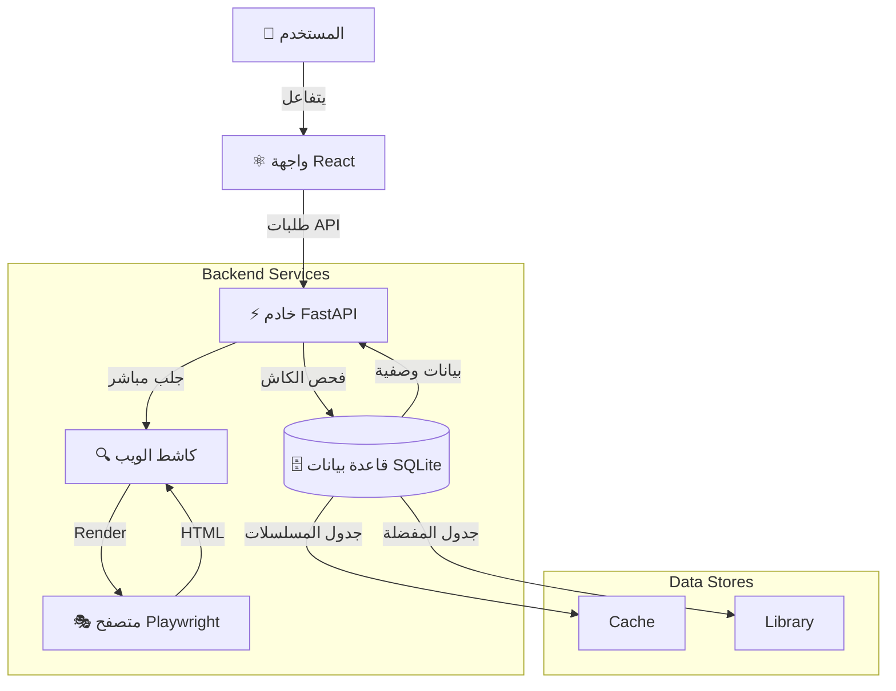

<div align="center" dir="rtl">


<br/><br/>

# 🎬 محمّل الكارتون العربي

### ⚡ أسرع أداة لتحميل الكارتون العربي

<p align="center">
  <a href="#-البدء-السريع">
    
  </a>
  <a href="LICENSE">
    
  </a>
</p>

<p align="center">
  
  
  
  
</p>

---

### 🚀 **حمّل مسلسلات كاملة بضغطة واحدة**
**تخزين ذكي • مكتبة شخصية • تصدير جاهز لـ Plex**

<br/>

</div>

<div dir="rtl">

## ✨ لماذا هذا التطبيق؟

<div align="center">

| ⚙️ **تحكم كامل** | ❤️ **تجربة رائعة** | 🚀 **سرعة فائقة** |
|:---:|:---:|:---:|
| **تسمية Plex**<br/>للخوادم المنزلية | **مكتبتي**<br/>حفظ المسلسلات | **تحميل دفعات**<br/>100+ حلقة فوراً |
| **تصدير مباشر**<br/>لبرنامج IDM / Aria2 | **وضع داكن**<br/>مريح للعين | **كاش ذكي**<br/>تخزين 24 ساعة |

</div>

---

## 📸 جولة بصرية

<table align="center" style="border: none;">
  <tr>
    <td align="center" width="33%">
      
      <br/><b>📚 مكتبتي</b>
    </td>
    <td align="center" width="33%">
      
      <br/><b>⚙️ الإعدادات</b>
    </td>
    <td align="center" width="33%">
      
      <br/><b>📥 المحمّل</b>
    </td>
  </tr>
</table>

---

## 🚀 البدء السريع

<div align="center">

```bash
# 1. استنساخ المشروع
git clone https://github.com/3bkader-gpt/cartoon.git
cd cartoon

# 2. إعداد الخادم
pip install -r requirements.txt
playwright install chromium

# 3. إعداد الواجهة
cd frontend && npm install
```

**تشغيل التطبيق**

```bash
# Terminal 1             # Terminal 2
python backend/main.py   npm run dev
```

### [افتح التطبيق ↗](http://localhost:5173)

</div>

---

## 🏗️ تحت الغطاء

<details>
<summary><b>اضغط لرؤية المخطط المعماري</b></summary>
<br/>



</details>

---

## 🗺️ خريطة الطريق

- [x] **v3.0** - المحمّل الأساسي (IndexedDB)
- [x] **v4.0** - الترحيل للخادم (SQLite)
- [x] **v4.1** - نظام المكتبة
- [x] **v4.2** - الإعدادات والتخصيص
- [ ] **v5.0** - **مدير التحميلات الداخلي** 🏗️
- [ ] **v6.0** - دعم مصادر متعددة 🔮

---

<div align="center">

### 👨‍💻 المطوّر

<a href="https://github.com/3bkader-gpt">
  
</a>

<br/><br/>

إذا أعجبك المشروع، لا تبخل علينا بـ ⭐ **نجمة**!

<br/>


</div>

</div>
