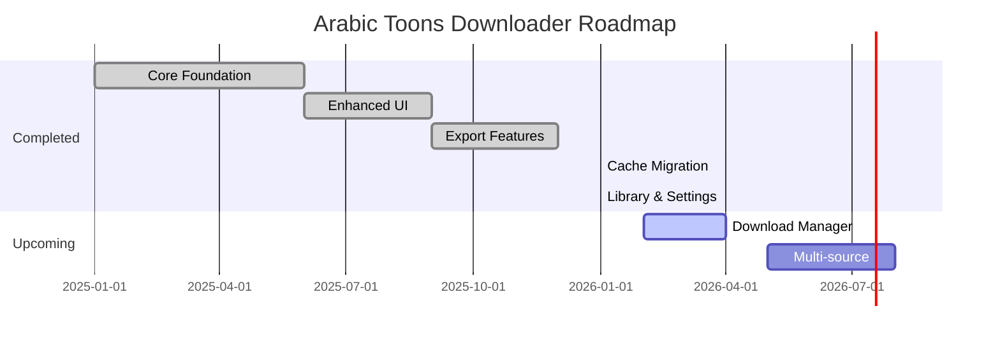

# Project Status

> **Current Version:** v4.2.0  
> **Last Updated:** 2026-01-19  
> **Status:** ✅ Stable

---

## 🎯 Project Overview

Arabic Toons Downloader is a specialized high-performance media downloader optimized for arabic-toons.com. The project has evolved from a simple frontend-only tool to a full-stack application with backend caching, library management, and customizable settings.

---

## 📊 Phase Completion Status

### Phase 1: Core Foundation ✅
- [x] FastAPI backend setup
- [x] Playwright browser automation
- [x] Episode scraping engine
- [x] Basic React frontend
- [x] URL parsing and validation

### Phase 2: Enhanced UI ✅
- [x] Modern dark theme design
- [x] Episode grid layout
- [x] Progress indicators
- [x] Selection management (Select All/Deselect)
- [x] Episode filtering and sorting

### Phase 3: Export Features ✅
- [x] IDM export (.ef2 format)
- [x] Text export (.txt format)
- [x] Copy individual URLs
- [x] Metadata display (file sizes)

### Phase 4: Cache Migration (v4.0) ✅
- [x] SQLite database design
- [x] `series` table with metadata
- [x] `episodes` table with UNIQUE constraint
- [x] Backend cache-first logic
- [x] 24-hour cache freshness
- [x] `force_refresh` parameter
- [x] Remove frontend IndexedDB code

### Phase 5: Library & Settings (v4.1 - v4.2) ✅
- [x] `is_favorite` column on series table
- [x] Toggle favorite API (`/library/toggle`)
- [x] Check favorite API (`/library/check`)
- [x] Library page UI
- [x] Heart button on downloader
- [x] Settings page
- [x] Dark/Light theme toggle
- [x] Plex/Kodi naming convention
- [x] Open Downloads folder button
- [x] Health check endpoint

### Phase 6: Internal Download Manager (v5.0) 🔜
- [ ] Download queue system
- [ ] Progress tracking per file
- [ ] Pause/Resume functionality
- [ ] Parallel downloads
- [ ] Native file saving (no IDM)

---

## 🗂️ Database Schema

```sql
-- Series cache with favorites
CREATE TABLE series (
    url TEXT PRIMARY KEY,
    title TEXT NOT NULL,
    thumbnail TEXT,
    total_episodes INTEGER,
    is_favorite BOOLEAN DEFAULT 0,
    last_fetched_at TIMESTAMP DEFAULT CURRENT_TIMESTAMP
);

-- Episodes with duplicate prevention
CREATE TABLE episodes (
    id INTEGER PRIMARY KEY AUTOINCREMENT,
    series_url TEXT NOT NULL,
    episode_number INTEGER NOT NULL,
    title TEXT,
    video_url TEXT,
    video_info TEXT,
    size_bytes INTEGER,
    thumbnail TEXT,
    episode_url TEXT,
    UNIQUE(series_url, episode_number),
    FOREIGN KEY(series_url) REFERENCES series(url) ON DELETE CASCADE
);

-- Legacy favorites (deprecated, kept for migration)
CREATE TABLE favorites (
    id INTEGER PRIMARY KEY AUTOINCREMENT,
    title TEXT NOT NULL,
    url TEXT NOT NULL UNIQUE,
    thumbnail TEXT,
    created_at TIMESTAMP DEFAULT CURRENT_TIMESTAMP
);
```

---

## 🔄 Changelog

### v4.2.0 (2026-01-19)
**Settings & Polish**
- ✨ Added Settings page with full UI
- 🌙 Theme toggle (Dark/Light mode)
- 📁 Open Downloads folder button
- 🏥 Health check endpoint `/api/health`
- 📝 Version display in UI footer

### v4.1.0 (2026-01-19)
**My Library Feature**
- ❤️ Added `is_favorite` column to series table
- 🔁 Toggle favorite API (`POST /library/toggle`)
- ✅ Check favorite API (`GET /library/check`)
- 📚 Library page showing all favorites
- 💜 Heart button on downloader header

### v4.0.0 (2026-01-19)
**SQLite Cache Migration**
- 🗄️ Migrated cache from IndexedDB to SQLite
- 📊 New `series` and `episodes` tables
- 🔒 UNIQUE constraint prevents duplicate episodes
- ⏰ 24-hour cache freshness check
- 🔄 Upsert pattern for safe updates
- 🧹 Removed all frontend IndexedDB code
- 🐛 Fixed "185 episodes for 13-episode series" bug
- 🐛 Fixed React StrictMode double-fetch bug

### v3.1.2 (Previous)
**Stability Hotfixes**
- Fixed "Unknown Series" cache collision
- Fixed duplicate episode accumulation
- Fixed auto-fetch reliability from Library

---

## 🚧 Known Issues

| Issue | Status | Workaround |
|-------|--------|------------|
| Concurrent fetches may conflict | 🟡 Minor | Wait for one fetch to complete |
| Browser tab must stay active | 🟡 Minor | Use IDM for background downloads |
| Some videos require proxy | 🟡 Minor | Proxy endpoint available |

---

## 📈 Roadmap



### Next Milestone: v5.0 - Internal Download Manager
- **Goal:** Replace IDM dependency with native downloads
- **Features:**
  - Download queue with parallel processing
  - Progress tracking per file
  - Pause/Resume support
  - Auto-retry on failure
  - Download history

---

## 🧪 Testing Checklist

### v4.2 Verification
- [x] Theme toggle persists across page reload
- [x] Plex naming generates correct filenames
- [x] Open Downloads folder works on Windows
- [x] Health endpoint returns version
- [x] Settings page renders correctly

### v4.1 Verification
- [x] Heart button toggles favorite status
- [x] Library page shows all favorites
- [x] Clicking library card navigates to downloader
- [x] Favorite status persists in database

### v4.0 Verification
- [x] Cache hit serves from SQLite (no scraping)
- [x] Cache miss triggers web scrape
- [x] Duplicate episodes prevented by UNIQUE constraint
- [x] Force refresh bypasses cache
- [x] FOREIGN KEY constraint enforced

---

## 📞 Support

For issues or feature requests, please open a GitHub issue.
